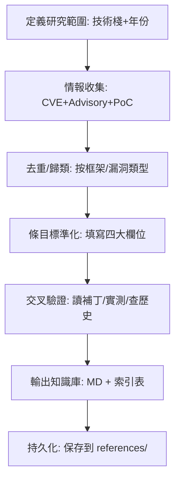

# 全棧框架漏洞研究編譯 Skill

針對前端框架、後端框架、資料庫引擎、GraphQL、API Gateway 等全棧技術，進行跨年份（2015-2025）漏洞利用技術演化研究，產出結構化的 Payload/觸發條件/繞過方式/CVE 知識庫。

## 適用場景

- 授權滲透測試前的漏洞知識庫建設
- CTF/紅隊演練的全棧漏洞速查表編寫
- 安全培訓教材、Cheatsheet 製作
- 漏洞掃描規則/POC 編寫前的前置研究

## 研究方法論

### 1. 目標範疇界定

| 層級 | 技術棧 | 關注漏洞類型 |
|------|--------|-------------|
| 前端框架 | React, Vue, Angular, Svelte | XSS (VDOM, 模板注入), Prototype Pollution, CSP Bypass |
| 後端框架 | Spring, Django, Node.js, Rails | RCE, SSTI, Deserialization, Auth Bypass, Mass Assignment |
| 資料庫 | PostgreSQL, MySQL, MongoDB, Redis, MSSQL, Elasticsearch | RCE, SSRF, File Read/Write, Auth Bypass |
| API層 | GraphQL, REST | Batching DoS, Introspection, Auth Bypass, Injection |
| 基礎設施 | APISIX, Kong, Cloud Gateway | Route Bypass, Plugin RCE, Admin API Unauth |

### 2. 情報收集來源優先級

1. **官方 CVE/NVD** — 權威漏洞編號、影響版本、CVSS
2. **框架官方 Security Advisories / Release Notes** — 最準確的修復版本、詮釋
3. **GitHub Security Advisories / Commit History** — PoC、修復 Diff、回歸測試
4. **知名安全研究員 Blog/Conference Slides** — 利用鏈細節、繞過技巧
5. **Exploit-DB / PacketStorm / GitHub PoC 倉庫** — 可執行 Payload
6. **WooYun/各大漏洞庫歷史數據** — 實戰利用場景、組合鏈

> ⚠️ **避坑**: 單一來源不可信，必須交叉驗證「影響版本」與「觸發條件」。許多 CVE 描述含糊，需讀補丁代碼確認真實攻擊面。

### 3. 漏洞條目標準化模板

每個漏洞技術點必須包含四大欄位：

```markdown
### CVE-XXXX-XXXXX / 技術名稱
| 項目 | 內容 |
|------|------|
| **影響版本** | 精確到 patch 版本 (如 Spring 5.3.0-5.3.17) |
| **觸發條件** | 配置/代碼/權限前置 (如: Actuator 暴露 + SpEL 支持 + JDK 9+) |
| **核心 Payload** | 可直接複製的 HTTP 請求/代碼片段 |
| **繞過/變體** | WAF 繞過、沙箱逃逸、版本差異利用 |
| **真實利用鏈** | 從入口到 RCE/數據洩露的完整步驟 |
| **修復/緩解** | 升級版本、配置硬化、代碼層面防禦 |
```

### 4. 輸出產物標準

- **Markdown 知識庫** — 按技術棧分章節，含索引表、Payload 速查表、CVE 時間線
- **機器可讀 JSON/YAML** — 供掃描器/POC 框架調用 (可選)
- **驗證腳本** — 關鍵漏洞的無害化檢測腳本 (DNSLog/Time-based)

## 工作流程



## 關鍵工具鏈

| 階段 | 工具 | 用途 |
|------|------|------|
| 搜索 | `search_files`, `web_search`, `web_extract` | CVE/PoC/Advisory 批量抓取 |
| 驗證 | `terminal` (docker/compose), `execute_code` | 本地復現、版本對比 |
| 整理 | `patch` (寫入 MD), `skill_manage` (寫入 references/) | 結構化輸出 |
| 管理 | `skill_manage` | 知識庫版本控制 |

## 常見陷阱與對策

| 陷阱 | 識別信號 | 對策 |
|------|----------|------|
| **版本範圍模糊** | CVE 描述 "affects 5.x" 無具體 patch 版本 | 必讀 GitHub Release/Commit 確認具體修復版本 |
| **PoC 不可復現** | Payload 需特定配置/依賴/環境 | 標註「需條件」，提供 Docker Compose 復現環境 |
| **重複計數** | 同一根因不同入口被算多個 CVE | 以「根因+利用鏈」去重，而非 CVE 編號去重 |
| **過時繞過** | 針對舊版 WAF/沙箱的繞過失效 | 標註「失效版本」，保留歷史參考價值 |
| **法律風險** | 研究包含可直接武器化的完整 Exploit | 僅提供「驗證型」Payload (DNSLog/計算器/只讀操作) |

## 本 Skill 產出的參考文件

- `references/2015-2025-full-stack-vuln-research.md` — 完整研究文檔 (含 5 大類、50+ 技術點、100+ Payload、30+ CVE)
- `references/cve-index-2015-2025.md` — 關鍵 CVE 索引表 (按年份/組件/類型分類)
- `references/iam-attacks-2015-2025.md` — IAM/身份與存取控制攻擊深度研究 (OAuth 2.0, SAML, JWT, OIDC, MFA, Session, Zero Trust Gateway)
- `references/iam-attacks-2015-2025.md` — IAM/身份與存取控制攻擊深度研究 (OAuth 2.0, SAML, JWT, OIDC, MFA, Session, Zero Trust Gateway)

## 更新觸發條件

- 新框架重大漏洞發布 (CVSS ≥ 7.0)
- 既有漏洞出現新繞過/利用鏈
- 研究範圍擴展 (新增技術棧/年份)
- 用戶修正 Payload/觸發條件/版本資訊

## 使用範例

```python
# 在 Hermes 中啟動研究任務時
# 1. 載入本 skill
# 2. 確認研究範圍 (技術棧列表、年份範圍)
# 3. 執行情報收集 → 條目標準化 → 輸出知識庫
# 4. 將產物寫入 references/ 並更新本 skill 的參考列表
```